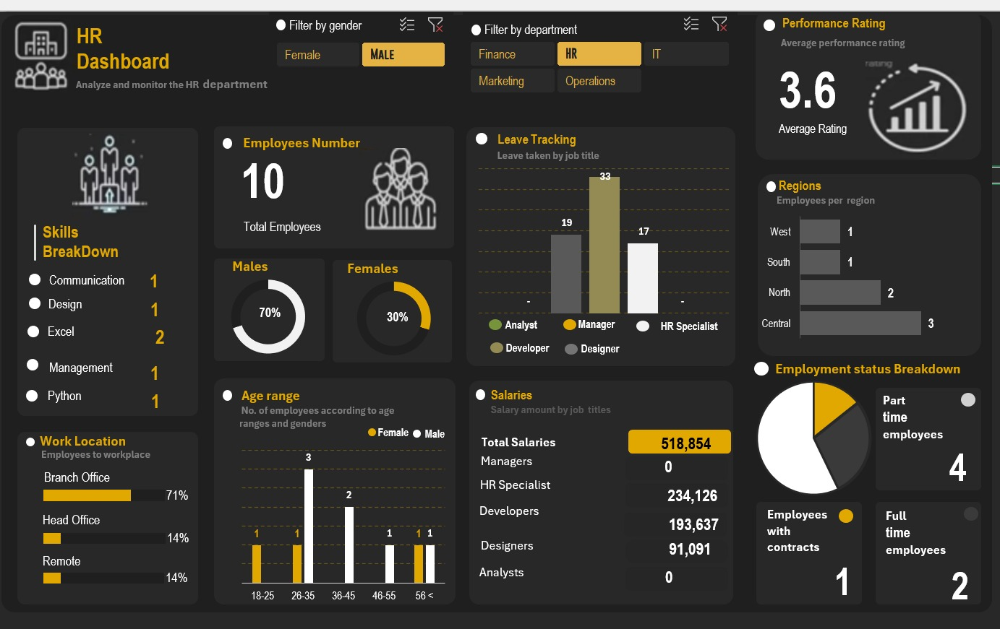

📊 #**HR Dashboard Analysis (Excel Project)**

📌**Overview**
- This project is an interactive HR dashboard developed using Microsoft Excel to analyze and visualize employee data. It provides key insights into workforce distribution, performance ratings, salary structure, and employment trends.

## 📸 Dashboard Preview

⚠️ **Disclaimer**
- This dashboard was recreated as part of my learning process using a YouTube tutorial.
- The objective of this project was to strengthen my practical skills in data analysis, dashboard design, and data visualization using Excel.

🛠️**Tools Used**
- Microsoft Excel
  
🎯 #**Key Features**
- Total employee overview
- Gender distribution analysis
- Performance rating insights
- Salary breakdown by job roles
- Leave tracking by position
- Age group distribution
- Regional employee distribution
- Employment status (Full-time, Part-time, Contract)
- Interactive filters (Gender & Department)
  
📚**Learning Source**
- YouTube tutorial ( Skillify channel)

💡 **Skills Demonstrated**
- Data cleaning and structuring
- Pivot tables and pivot charts
- Dashboard design and layout
- Data storytelling
- Interactive filtering

👩‍💻**Author**
Princess Chukwubuike
Aspiring Data Analyst & Digital Marketer
